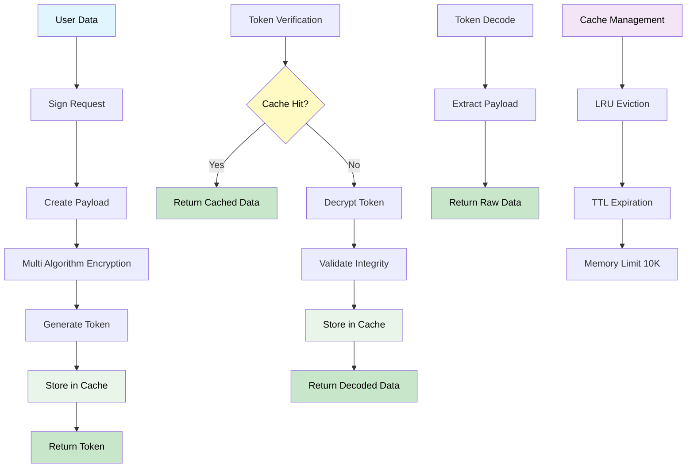
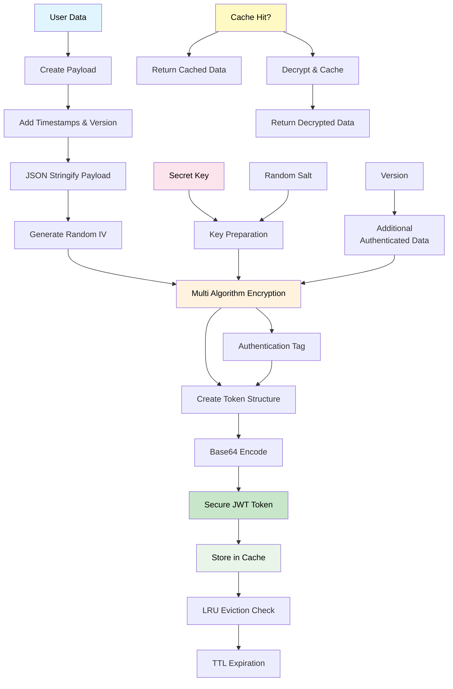
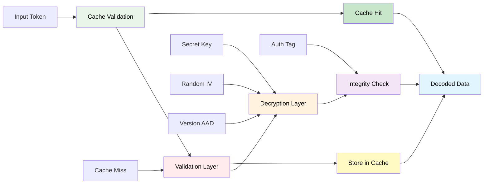

## 🏗️ Architecture

### 🔄 Complete Data Flow

> This diagram shows the complete JWT workflow from data input to output. The **Sign** process creates encrypted tokens and stores them in cache, while **Verify** operations check cache first for 1,600x performance boost. **Decode** extracts raw data without verification, and **Cache Management** ensures memory efficiency with LRU eviction and TTL expiration.

---

### 🔐 JWT Encoding Process

> This diagram details the token creation process with **multi-algorithm encryption**. Each token gets a **random IV** for uniqueness, **version-based AAD** for compatibility, and **authentication tags** for tamper detection. The **caching system** stores encrypted tokens for instant retrieval, providing massive performance improvements for repeated verifications.

---

### 🛡️ Security Layers

> This diagram illustrates the security-focused verification process. **Cache validation** provides the first security layer, preventing DoS attacks through performance optimization. **Decryption** uses the secret key and random IV, while **integrity checks** verify authentication tags. The **caching system** acts as both a performance and security feature, ensuring fast and secure token validation.

