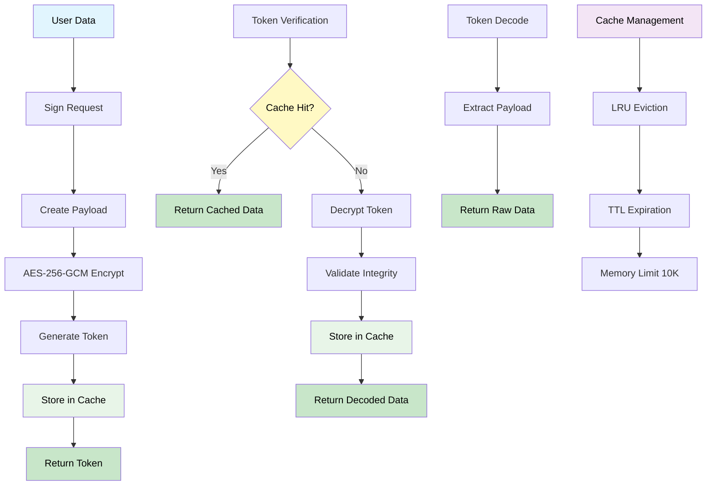
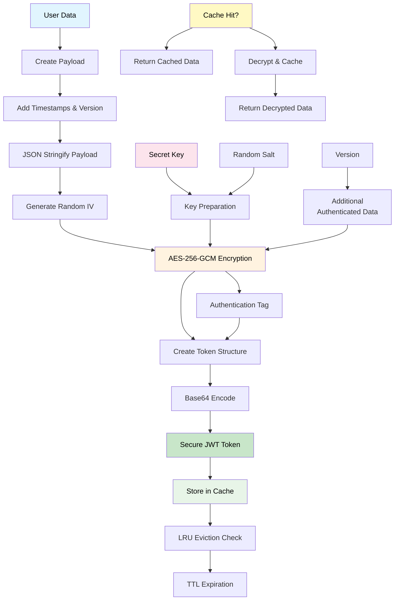
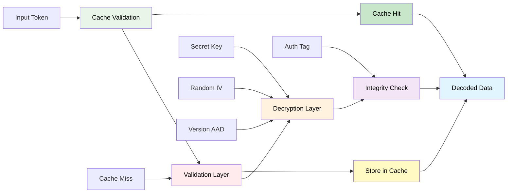

# 🔐 Secure-JWT


A secure JWT implementation with **AES-256-GCM** & **ChaCha20-Poly1305** algorithms for Node.js applications.

## ✨ Features

- 🔒 **Multi algorithms** - AES-256-GCM & ChaCha20-Poly1305
- ⚙️ **Algorithm selection** - Choose the best encryption for your use case
- 🛡️ **Tamper detection** - Authentication tags prevent modification
- ⏰ **Automatic expiration** - Built-in token lifecycle management
- 🔄 **Version compatibility** - Prevents downgrade attacks
- 🚀 **Built-in caching** - LRU cache with TTL for performance
- 📏 **Payload size limits** - 8KB maximum to prevent DoS
- 📦 **Multi-format support** - ESM, CommonJS, and TypeScript
- ⚡ **Zero dependencies** - No external crypto libraries

---

## 📦 Installation

```bash
npm install @neabyte/secure-jwt
```

## 🚀 Usage

### CommonJS

```javascript
const SecureJWT = require('@neabyte/secure-jwt').default

const jwt = new SecureJWT({
  secret: 'your-secret-key-here',
  expireIn: '1h',
  version: '1.0.0',
  cached: 1000
})

// Encode any data type
const data = { userId: 123, role: 'admin' }
const token = jwt.sign(data)
const isValid = jwt.verify(token)
const decoded = jwt.decode(token)

// Also works with strings, numbers, arrays, etc.
const stringToken = jwt.sign('Hello World!')
const numberToken = jwt.sign(42)
const arrayToken = jwt.sign([1, 2, 3])
```

### ES Modules (ESM)

```javascript
import SecureJWT from '@neabyte/secure-jwt'

const jwt = new SecureJWT({
  secret: 'your-secret-key-here',
  expireIn: '1h',
  version: '1.0.0',
  cached: 1000
})

// Encode any data type
const data = { userId: 123, role: 'admin' }
const token = jwt.sign(data)
const isValid = jwt.verify(token)
const decoded = jwt.decode(token)

// Also works with strings, numbers, arrays, etc.
const stringToken = jwt.sign('Hello World!')
const numberToken = jwt.sign(42)
const arrayToken = jwt.sign([1, 2, 3])
```

### TypeScript

```typescript
import SecureJWT from '@neabyte/secure-jwt'

const jwt = new SecureJWT({
  secret: 'your-secret-key-here',
  expireIn: '1h',
  version: '1.0.0',
  cached: 1000
})

// Encode any data type
const data: { userId: number; role: string } = { userId: 123, role: 'admin' }
const token: string = jwt.sign(data)
const isValid: boolean = jwt.verify(token)
const decoded: unknown = jwt.decode(token)

// Also works with strings, numbers, arrays, etc.
const stringToken: string = jwt.sign('Hello World!')
const numberToken: string = jwt.sign(42)
const arrayToken: string = jwt.sign([1, 2, 3])
```

---

## ⚙️ Configuration

### Constructor Options

```javascript
const jwt = new SecureJWT({
  secret: 'your-secret-key',     // Required: 8-255 characters
  expireIn: '1h',                // Required: Time string
  algorithm: 'aes-256-gcm',      // Optional: default: 'aes-256-gcm'
  version: '1.0.0',              // Optional: Default '1.0.0'
  cached: 1000                   // Optional: Cache size (default: 1000)
})
```

### 🔧 Algorithm Options

Choose the encryption algorithm that best fits your needs:

```javascript
// AES-256-GCM (default) - Hardware accelerated, industry standard
const jwtAES = new SecureJWT({
  algorithm: 'aes-256-gcm',
  secret: 'key',
  expireIn: '1h'
})

// ChaCha20-Poly1305 - Maximum performance, 2-3x faster
const jwtChaCha = new SecureJWT({
  algorithm: 'chacha20-poly1305',
  secret: 'key',
  expireIn: '1h'
})
```

**Algorithm Comparison:**
- **AES-256-GCM**: Hardware accelerated, widely supported, industry standard
- **ChaCha20-Poly1305**: Software optimized, 2-3x faster, perfect for high-throughput applications

### Time Format

```javascript
// Supported formats
'1ms'   // 1 millisecond
'1s'    // 1 second  
'1m'    // 1 minute
'1h'    // 1 hour
'1d'    // 1 day
'1M'    // 1 month (30 days)
'1y'    // 1 year (365 days)
```

---

## 📝 API Reference

### Constructor

```javascript
new SecureJWT(options: JWTOptions)
```
**Available Algorithm:**
- `aes-256-gcm`
- `chacha20-poly1305`

**Options:**
- `algorithm?:` - Encryption algorithm (default: 'aes-256-gcm')
- `secret: string` - Secret key (8-255 chars, required for security)
- `expireIn: string` - Token expiration time (required for security)
- `version?: string` - Token version (default: '1.0.0')
- `cached?: number` - Cache size for performance (default: 1000)

### Methods

#### `sign(data: unknown): string`
Creates encrypted JWT token from data.

#### `verify(token: string): boolean`
Validates token, returns true/false.

#### `verifyStrict(token: string): void`
Validates token, throws specific errors.

#### `decode(token: string): unknown`
Extracts data from token, throws on error.

## ❌ Error Handling

```javascript
// Using verify() - returns boolean
const isValid = jwt.verify(token)
if (!isValid) {
  console.log('Token is invalid or expired')
}

// Using verifyStrict() - throws errors
try {
  jwt.verifyStrict(token)
  console.log('Token is valid')
} catch (error) {
  console.log('Token error:', error.message)
}

// Using decode() - throws errors
try {
  const data = jwt.decode(token)
  console.log('Decoded data:', data)
} catch (error) {
  console.log('Decode error:', error.message)
}
```

---

## 🏗️ Architecture

### 🔄 Complete Data Flow

> This diagram shows the complete JWT workflow from data input to output. The **Sign** process creates encrypted tokens and stores them in cache, while **Verify** operations check cache first for 1,600x performance boost. **Decode** extracts raw data without verification, and **Cache Management** ensures memory efficiency with LRU eviction and TTL expiration.



---

### 🔐 JWT Encoding Process

> This diagram details the token creation process with AES-256-GCM encryption. Each token gets a **random IV** for uniqueness, **version-based AAD** for compatibility, and **authentication tags** for tamper detection. The **caching system** stores encrypted tokens for instant retrieval, providing massive performance improvements for repeated verifications.



---

### 🛡️ Security Layers

> This diagram illustrates the security-focused verification process. **Cache validation** provides the first security layer, preventing DoS attacks through performance optimization. **Decryption** uses the secret key and random IV, while **integrity checks** verify authentication tags. The **caching system** acts as both a performance and security feature, ensuring fast and secure token validation.



---

## 📄 License

This project is licensed under the MIT license. See the [LICENSE](LICENSE) file for more info.