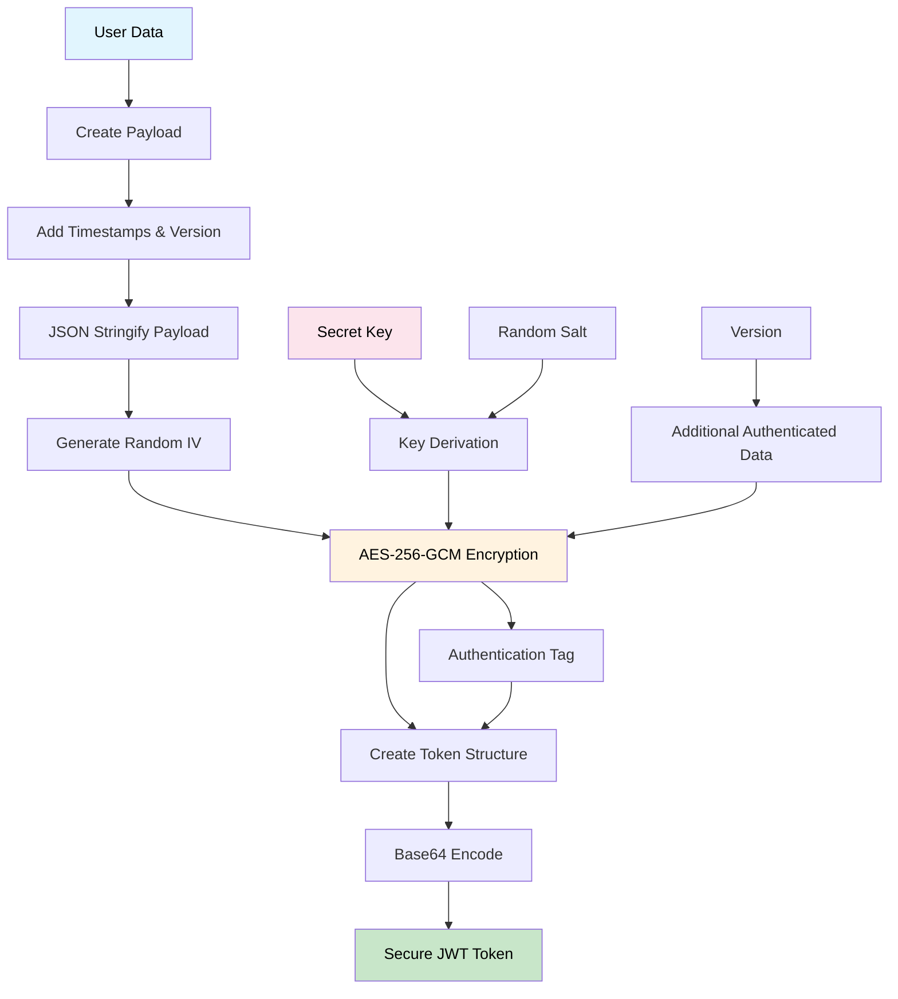
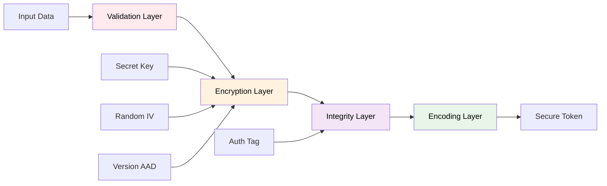

# 🔐 Secure-JWT


A secure JWT implementation with AES-256-GCM encryption for Node.js applications.

## ✨ Features

- 🔒 **AES-256-GCM encryption** - Industry-standard security
- 🛡️ **Tamper detection** - Authentication tags prevent modification
- ⏰ **Automatic expiration** - Built-in token lifecycle management
- 🔄 **Version compatibility** - Prevents downgrade attacks
- 🚀 **Built-in caching** - LRU cache with TTL for performance
- 📏 **Payload size limits** - 8KB maximum to prevent DoS
- 📦 **Multi-format support** - ESM, CommonJS, and TypeScript
- ⚡ **Zero dependencies** - No external crypto libraries

---

## 📦 Installation

```bash
npm install @neabyte/secure-jwt
```

## 🚀 Usage

### CommonJS

```javascript
const SecureJWT = require('@neabyte/secure-jwt').default

const jwt = new SecureJWT({
  secret: 'your-secret-key-here',
  expireIn: '1h',
  cached: 1000
})

const data = { userId: 123, role: 'admin' }
const token = jwt.sign(data)
const isValid = jwt.verify(token)
const decoded = jwt.decode(token)
```

### ES Modules (ESM)

```javascript
import SecureJWT from '@neabyte/secure-jwt'

const jwt = new SecureJWT({
  secret: 'your-secret-key-here',
  expireIn: '1h',
  cached: 1000
})

const data = { userId: 123, role: 'admin' }
const token = jwt.sign(data)
const isValid = jwt.verify(token)
const decoded = jwt.decode(token)
```

### TypeScript

```typescript
import SecureJWT from '@neabyte/secure-jwt'

const jwt = new SecureJWT({
  secret: 'your-secret-key-here',
  expireIn: '1h',
  cached: 1000
})

const data: { userId: number; role: string } = { userId: 123, role: 'admin' }
const token: string = jwt.sign(data)
const isValid: boolean = jwt.verify(token)
const decoded: unknown = jwt.decode(token)
```

---

## ⚙️ Configuration

### Constructor Options

```javascript
const jwt = new SecureJWT({
  secret: 'your-secret-key',     // Required: 8+ characters
  expireIn: '1h',                // Required: Time string
  version: '1.0.0',              // Optional: Default '1.0.0'
  cached: 1000                   // Optional: Cache size (default: 1000)
})
```

### Time Format

```javascript
// Supported formats
'1ms'   // 1 millisecond
'1s'    // 1 second  
'1m'    // 1 minute
'1h'    // 1 hour
'1d'    // 1 day
'1M'    // 1 month (30 days)
'1y'    // 1 year (365 days)
```

---

## 📝 API Reference

### Constructor

```javascript
new SecureJWT(options: JWTOptions)
```

**Options:**
- `secret?: string` - Secret key (8+ chars, optional)
- `expireIn: string` - Token expiration time
- `version?: string` - Token version (default: '1.0.0')
- `cached?: number` - Cache size for performance (default: 1000)

### Methods

#### `sign(data: unknown): string`
Creates encrypted JWT token from data.

#### `verify(token: string): boolean`
Validates token, returns true/false.

#### `verifyStrict(token: string): void`
Validates token, throws specific errors.

#### `decode(token: string): unknown`
Extracts data from token, throws on error.

## ❌ Error Handling

```javascript
// Using verify() - returns boolean
const isValid = jwt.verify(token)
if (!isValid) {
  console.log('Token is invalid or expired')
}

// Using verifyStrict() - throws errors
try {
  jwt.verifyStrict(token)
  console.log('Token is valid')
} catch (error) {
  console.log('Token error:', error.message)
}

// Using decode() - throws errors
try {
  const data = jwt.decode(token)
  console.log('Decoded data:', data)
} catch (error) {
  console.log('Decode error:', error.message)
}
```

---

## 🏗️ Architecture

### JWT Encoding Process



### Security Layers



---

## 📄 License

This project is licensed under the MIT license. See the [LICENSE](LICENSE) file for more info.